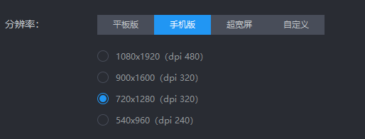

# AutoJR
基于airtest.netease框架的《战舰少女R》自动化脚本，旨在实现"完全自动化“和”与人类玩家不可区分“两大目标。

*(更新于2021/08/30)*


## 运行方式

>  环境配置 & 运行指令

- 电脑安装**[雷电模拟器](https://www.ldmnq.com/)**，并在设置中将分辨率更改为**手机版720x1280(dpi 320)**



- 使用模拟器自带的**雷电游戏中心**安装**战舰少女R**，也可以选择[官网](http://www.jianniang.com/)安装。

- 安装依赖

    ```shell
    pip install -r requirements.txt
    ```

- 将**config_template.json**中相关信息修改为你的配置，并重命名为**config.json**

- 运行

    ```shell
    python AutoJR.py
    ```

    

## 已完成功能

> 更多功能适配中，欢迎在issue中反馈

#### 游戏控制模块

- 基础控制功能
  - [x] 从windows运行模拟器，从模拟器运行游戏
  - [x] 登录游戏，可以处理的特殊情况有：服务器授权、下载资源、同意条款、登录账号、关闭活动通知、领取每日奖励
  - [ ] SL
    - [x] 大退：杀进程并重新运行游戏
    - [ ] 小退：点击撤退按钮

- 复合控制功能
  - [x] 判断当前所处状态：设备主页，游戏主页，任务船坞出征$\dots$​
  - [x] 从任意位置复位到主页


#### 基于Task的调度策略

- 将Task视作进程，具有[唤醒时间，优先级]等属性，实现具体功能。Strategy视作操作系统，负责调度Task。
- Task
  - [x] ~~定点远征：假设远征队已经派出，自动设置远征结束时唤醒并重复派遣。暂定每隔10 min（合并）~~
  - [x] ~~定时检查任务：暂定每隔1h（合并）~~
  - [x] （新）定时任务+远征，直接检测红点
  - [x] 定时检查邮箱：主要时为了收取月卡每日奖励。暂定每隔2h
  - [x] 定时重启
    - [x] 游戏：刷新每日任务和登录奖励。暂定每日凌晨3点
    - [x] 模拟器：解决长时间运行未知Bug。暂定每隔6h重启一次模拟器
  - [ ] 刷图
- Strategy
  - [x] 临时策略：添加上述所有Task


## future work

> 有空就做

- 全局运营策略：资源负载均衡自动调配，远征选择，舰娘数据库和规则库，常用出征图策略，决战、战利品策略

- 图像识别速度很慢，每一次调用都需要数秒，考虑用基于渲染树的库改进
- “人性化”改进，加入[随即等待、随机位移、下线休息]
